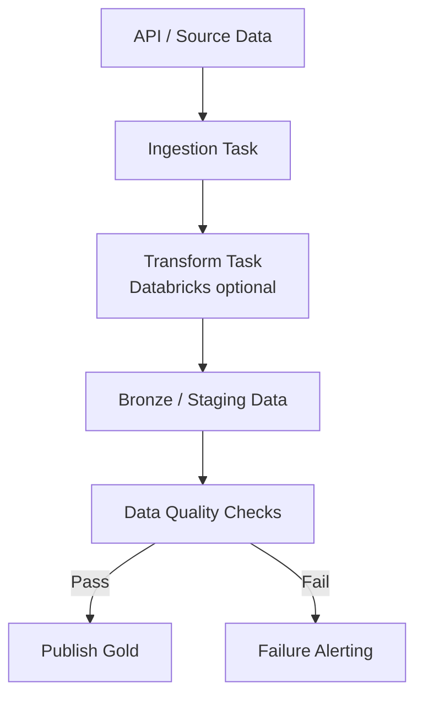

# Airflow Orchestration Pipeline

This project is a concrete blueprint for designing and implementing a production-style Airflow orchestration layer.

## 1. Architecture Diagram



## 2. Design Principles

1. Keep orchestration and transformation separate.
2. Make every task idempotent so reruns are safe.
3. Gate publication with data quality checks.
4. Use retries and timeouts for operational resilience.
5. Parameterize by execution date to support backfills.

## 3. Folder-by-Folder Responsibilities

### `configs/`
- Environment-specific values (dev, test, prod).
- Pipeline settings such as source endpoints, table names, and thresholds.
- Non-secret configuration only.

### `dags/`
- Airflow DAG definitions and shared DAG utilities.
- One DAG file per business domain or use case.
- Keep operators focused on orchestration logic.

### `logs/`
- Airflow task logs generated during local and CI runs.
- Useful for root-cause analysis and retry diagnostics.

### `notebooks/`
- Databricks or exploratory notebooks used by transform steps.
- Should align with DAG task boundaries.

### `plugins/`
- Custom Airflow operators, hooks, sensors, and macros.
- Reusable orchestration extensions for this project.

### `scripts/`
- Local helper scripts for setup, bootstrapping, and testing.
- Keep scripts deterministic and safe for repeated execution.

### `docker-compose.yml`
- Local Airflow runtime definition.
- Spins up required services for development and validation.

## 4. Implementation Steps

1. Start Airflow locally with Docker Compose.
2. Validate the DAG appears in the Airflow UI.
3. Run a manual trigger and inspect task logs.
4. Replace local transform and validation stubs with production logic.
5. Enable Databricks mode by setting `USE_DATABRICKS=true` and `DATABRICKS_JOB_ID=<job_id>`.

### Step 3 Runbook: Manual Trigger and Log Inspection

Run these commands from the `airflow-orchestration/` folder.

1. Ensure Docker helper path is available in Git Bash:

```bash
export PATH="$PATH:/c/Program Files/Docker/Docker/resources/bin"
```

2. Unpause and manually trigger the DAG:

```bash
docker compose exec -T airflow-webserver airflow dags unpause orchestration_pipeline_template
docker compose exec -T airflow-webserver airflow dags trigger orchestration_pipeline_template
```

3. Inspect the latest run and task states:

```bash
docker compose exec -T airflow-webserver airflow dags list-runs -d orchestration_pipeline_template --no-backfill | tail -n 20
docker compose exec -T airflow-webserver airflow tasks states-for-dag-run orchestration_pipeline_template <run_id>
```

Example `run_id` from a manual trigger:

```text
manual__2026-04-02T00:33:45+00:00
```

4. Inspect task logs from mounted files (CLI `tasks logs` is not available in this environment):

```bash
find logs/dag_id=orchestration_pipeline_template -type f | sort

for f in logs/dag_id=orchestration_pipeline_template/run_id=<run_id>/task_id=*/attempt=1.log; do
    echo "=== $f ==="
    tail -n 25 "$f"
    echo
done
```

5. Quick success criteria:
- DAG run state is `success`.
- `ingest`, `transform_local`, `validate`, and `publish` tasks are `success`.
- `notify_failure` is `skipped` when no failures occur.

## 5. Runtime Configuration

Use environment variables for runtime behavior:

- `USE_DATABRICKS`: `true` or `false`
- `DATABRICKS_JOB_ID`: Databricks job id when Databricks mode is enabled

Recommended Airflow connection names:

- `databricks_default`: Databricks workspace authentication

## 6. Operational Checklist

Before calling the pipeline production-ready:

1. Every task has retries, timeout, and clear failure behavior.
2. Data quality checks block bad data publication.
3. DAG supports reruns for a specific execution date.
4. Alerting captures task id, run id, and execution date.
5. Secrets are stored in Airflow Connections or a secret backend.

## 7. Future Enhancements

- Add lineage tracking and metadata capture.
- Add dbt tasks for model governance.
- Add SLA monitoring dashboards.
- Add contract tests for source schema drift.
