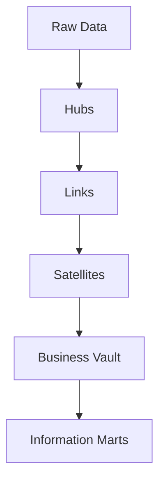

# Data Vault 2.0 Lakehouse Implementation

## 📌 Project Overview
A DV2 warehouse built on Databricks using Hubs, Links, and Satellites with automated loading patterns.

## 🏗️ Architecture Diagram




## 🛠️ Tech Stack
- Databricks
- Delta Lake
- PySpark
- DV2 modeling patterns

## ✨ Features
- Hubs, Links, Satellites
- Automated DV2 load patterns
- Comparison with Medallion Architecture

## 📂 Project Structure
```
data-vault-2.0/
        hubs/
                hub_tables.sql
        links/
                link_tables.sql
        satellites/
                satellite_tables.sql
        dv2-load-patterns/
                common_utils.py
                setup_staging_data.py
                load_hubs.py
                load_links.py
                load_satellites.py
                run_end_to_end.py
        tests/
                validation_queries.sql
        README.md
```


## 🚀 How to Run
1. Load synthetic staging dataset (creates 5 Delta staging tables):
        - `dv2-load-patterns/setup_staging_data.py`
2. Run DDL scripts in order:
        - `hubs/hub_tables.sql`
        - `links/link_tables.sql`
        - `satellites/satellite_tables.sql`
3. Run load scripts in order:
        - `dv2-load-patterns/load_hubs.py`
        - `dv2-load-patterns/load_links.py`
        - `dv2-load-patterns/load_satellites.py`
4. Run integrity and historization checks:
        - `tests/validation_queries.sql`

### One-command pipeline run
Use `dv2-load-patterns/run_end_to_end.py` to run DDL creation, seed staging data, and execute hub/link/satellite loads in sequence.

## ✅ Current Implementation Status
- Raw Vault DDL created for all planned Hubs, Links, and Satellites.
- Deterministic SHA-256 hash key utilities implemented in PySpark.
- Incremental hub/link loaders implemented using anti-join new-key insertion.
- Satellite SCD2-style historization implemented with Delta merge and append.
- Data quality validation query pack added for key uniqueness and referential integrity.

## 🧠 Design Decisions
- Why DV2 for enterprise modeling  
- Hash key strategy  
- Satellite historization  

## 🔮 Future Enhancements
- Add PIT tables  
- Add bridge tables  

## 📚 Key Learnings
(Add your reflections)
