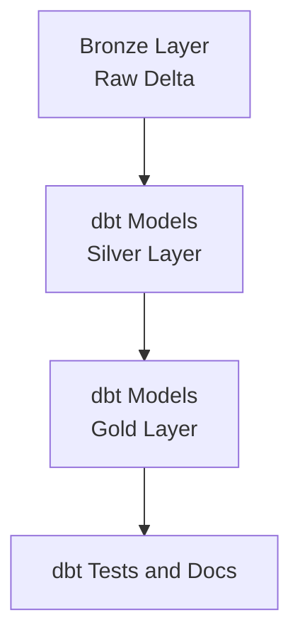

# dbt Lakehouse Modeling on Delta Lake

## 📌 Project Overview
A dbt project implementing Bronze → Silver → Gold transformations on Delta Lake with tests, snapshots, and documentation.

## 🏗️ Architecture Diagram




## 🛠️ Tech Stack
- dbt Core / dbt Cloud
- Databricks SQL
- Delta Lake

## ✨ Features
- Layered Lakehouse modeling
- dbt tests (unique, not null, accepted values)
- Snapshots for SCD handling
- Auto-generated documentation

## 📂 Project Structure
- models/
        - bronze/
        - silver/
        - gold/
- snapshots/
- tests/
- dbt_project.yml
- profiles.yml (local, not committed)


## 🚀 How to Run
### 1) Prerequisites
- Python 3.9+
- Access to a Databricks SQL Warehouse
- A Databricks personal access token (PAT)

### 2) Install dbt Core + Databricks adapter
```bash
python -m venv .venv
source .venv/Scripts/activate
pip install --upgrade pip
pip install dbt-core dbt-databricks
dbt --version
```

### 3) Configure your Databricks profile
Create or update your local dbt profiles file:

- Windows path: `C:\Users\<your-user>\.dbt\profiles.yml`
- Mac/Linux path: `~/.dbt/profiles.yml`

Example:

```yaml
lakehouse_dbt:
        target: dev
        outputs:
                dev:
                        type: databricks
                        catalog: main
                        schema: analytics_dev
                        host: dbc-xxxxxxxx-xxxx.cloud.databricks.com
                        http_path: /sql/1.0/warehouses/xxxxxxxxxxxx
                        token: dapi********************************
                        threads: 4
```

In your `dbt_project.yml`, set:

```yaml
profile: lakehouse_dbt
```

### 4) Validate connectivity
From this project folder, run:

```bash
dbt debug
```

Expected result: all checks pass.

### 5) Run the Bronze -> Silver -> Gold models
Run everything:

```bash
dbt run
```

Or run by layer:

```bash
dbt run --select models/bronze
dbt run --select models/silver
dbt run --select models/gold
```

### 6) Run tests
```bash
dbt test
```

Useful selective test runs:

```bash
dbt test --select tag:critical
dbt test --select models/silver
```

### 7) Run snapshots (SCD tracking)
```bash
dbt snapshot
```

### 8) Generate and view documentation
```bash
dbt docs generate
dbt docs serve
```

### 9) Typical daily workflow
```bash
dbt deps
dbt seed
dbt run
dbt test
dbt snapshot
```

### 10) Common issues
- Auth errors: re-check `host`, `http_path`, and PAT token.
- Schema permission errors: verify your Databricks user can create/update tables in target schema.
- Missing profile: confirm `profile:` in `dbt_project.yml` matches the profile name in `profiles.yml`.
- NO_SUCH_CATALOG_EXCEPTION for `main`: your workspace does not expose a catalog named `main`.
        - In Databricks SQL, run `show catalogs;` and pick an existing catalog (for example, `hive_metastore` or your Unity catalog).
        - Set that value in your dbt profile `catalog:` field.
        - If using `profiles.yml.example`, set environment variable `DBT_DATABRICKS_CATALOG` before running dbt.

Windows PowerShell example:

```powershell
$env:DBT_DATABRICKS_CATALOG = "workspace"
./dbt-task.ps1 debug
./dbt-task.ps1 run
```

## ⚡ Makefile-like Command Script (Windows)
Use the PowerShell task runner to execute common dbt workflows with one command:

```powershell
./dbt-task.ps1 help
./dbt-task.ps1 setup
./dbt-task.ps1 debug
./dbt-task.ps1 all
```

Available tasks: `help`, `setup`, `debug`, `seed`, `run`, `test`, `snapshot`, `docs`, `clean`, `all`.

## 🧠 Design Decisions
### Why dbt for Lakehouse modeling
This project uses dbt because it gives a reliable software engineering layer on top of Delta Lake SQL transformations.

- Clear dependency graph: model lineage is explicit and easy to reason about across Bronze -> Silver -> Gold.
- Version-controlled SQL: transformation logic is reviewed in Git instead of being hidden in notebooks.
- Repeatable deployments: the same project can run consistently across dev/test/prod targets.
- Built-in docs and lineage: `dbt docs` makes model intent and dependencies visible to both engineers and analysts.

### Layering decisions (Bronze / Silver / Gold)
- Bronze: lightweight typing and ingestion-ready structure from raw seed/source tables.
- Silver: business cleaning and normalization (status standardization, quality filters, derived flags).
- Gold: curated aggregates optimized for reporting and downstream consumption.

This separation keeps each model focused on one responsibility and reduces blast radius when logic changes.

### Naming conventions
- Model names are prefixed by layer (`bronze_`, `silver_`, `gold_`) to make purpose obvious.
- SQL files use entity-focused names (`silver_orders`, `gold_daily_sales`) for easy discoverability.
- Schemas are aligned with layers to simplify access control, troubleshooting, and governance.

### Testing strategy
Testing is applied at multiple levels to catch issues early and protect downstream models.

- Generic tests in `schema.yml` enforce structural quality (`not_null`, `unique`, `accepted_values`).
- Singular tests validate business expectations (for example, no negative daily revenue).
- Snapshot testing (`orders_snapshot`) preserves change history for SCD-style auditing.

Together, these tests provide confidence that Gold outputs remain trustworthy for analytics and dashboards.

## 🔮 Future Enhancements
- Add macros  
- Add incremental models  

## 📚 Key Learnings
(Add your reflections)
