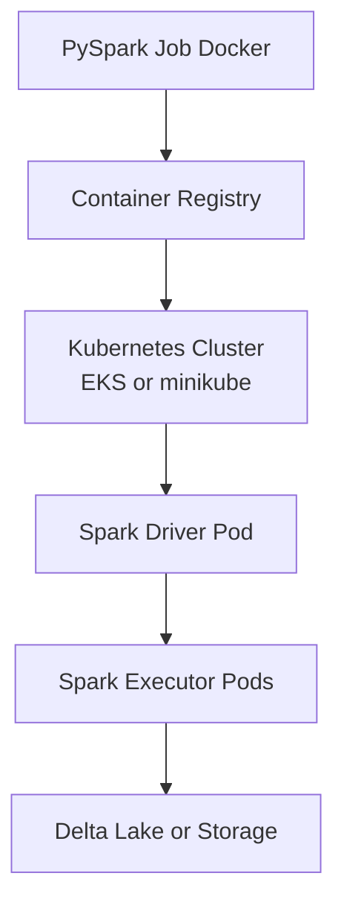

# Spark on Kubernetes (EKS/minikube)

## 📌 Project Overview
A PySpark job containerized and deployed on Kubernetes with Helm and autoscaling.

## 🏗️ Architecture Diagram




## 🛠️ Tech Stack
- Kubernetes / EKS
- Helm
- Docker
- PySpark

## ✨ Features
- Containerized Spark job
- Helm deployment
- Autoscaling configuration
- Cloud-native Spark execution

## 📂 Project Structure
docker/
        Dockerfile
        jobs/
helm/
        Chart.yaml
        values.yaml
        templates/
manifests/
        spark-submit.yaml


## 🚀 How to Run
### Prerequisites
Use this checklist first so both runbooks work without missing dependencies.

#### Required Tools
- Docker 24+ (image build/push)
- Kubernetes 1.28+ via minikube 1.32+ (local) or EKS (cloud)
- `kubectl` 1.28+
- Helm 3.12+
- Java 17 JDK (required by Spark)
- Spark 3.5+ CLI (`spark-submit`) if you submit jobs from your local shell
- AWS CLI v2 if using EKS

#### Optional but Recommended
- `eksctl` (faster EKS cluster bootstrap)
- `jq` (cleaner JSON parsing for troubleshooting)

#### Install Links and Commands

Docker
- Docs: https://docs.docker.com/get-docker/
```bash
# Windows (winget)
winget install -e --id Docker.DockerDesktop

# macOS (Homebrew cask)
brew install --cask docker

# Ubuntu/Debian
curl -fsSL https://get.docker.com | sh
sudo usermod -aG docker $USER
```

kubectl
- Docs: https://kubernetes.io/docs/tasks/tools/
```bash
# Windows (winget)
winget install -e --id Kubernetes.kubectl

# macOS (Homebrew)
brew install kubectl

# Ubuntu/Debian
sudo apt-get update
sudo apt-get install -y apt-transport-https ca-certificates curl gnupg
curl -fsSL https://pkgs.k8s.io/core:/stable:/v1.30/deb/Release.key | \
        sudo gpg --dearmor -o /etc/apt/keyrings/kubernetes-apt-keyring.gpg
echo 'deb [signed-by=/etc/apt/keyrings/kubernetes-apt-keyring.gpg] https://pkgs.k8s.io/core:/stable:/v1.30/deb/ /' | \
        sudo tee /etc/apt/sources.list.d/kubernetes.list
sudo apt-get update
sudo apt-get install -y kubectl
```

Helm
- Docs: https://helm.sh/docs/intro/install/
```bash
# Windows (winget)
winget install -e --id Helm.Helm

# macOS (Homebrew)
brew install helm

# Linux
curl https://raw.githubusercontent.com/helm/helm/main/scripts/get-helm-3 | bash
```

Spark
- Docs: https://spark.apache.org/downloads.html
```bash
# Windows (PowerShell)
$SPARK_VERSION = "3.5.1"
$HADOOP_PROFILE = "hadoop3"
$ZIP_URL = "https://archive.apache.org/dist/spark/spark-$SPARK_VERSION/spark-$SPARK_VERSION-bin-$HADOOP_PROFILE.tgz"
Invoke-WebRequest -Uri $ZIP_URL -OutFile "$env:TEMP\spark.tgz"
New-Item -ItemType Directory -Force -Path "C:\tools" | Out-Null
tar -xzf "$env:TEMP\spark.tgz" -C "C:\tools"
[Environment]::SetEnvironmentVariable("SPARK_HOME", "C:\tools\spark-$SPARK_VERSION-bin-$HADOOP_PROFILE", "User")
[Environment]::SetEnvironmentVariable("Path", $env:Path + ";C:\tools\spark-$SPARK_VERSION-bin-$HADOOP_PROFILE\bin", "User")

# macOS (Homebrew)
brew install apache-spark

# Ubuntu/Debian (Spark 3.5.x example)
SPARK_VERSION=3.5.1
HADOOP_PROFILE=hadoop3
curl -fL -o spark.tgz https://archive.apache.org/dist/spark/spark-${SPARK_VERSION}/spark-${SPARK_VERSION}-bin-${HADOOP_PROFILE}.tgz
sudo tar -xzf spark.tgz -C /opt
echo 'export PATH=/opt/spark-'"${SPARK_VERSION}"'-bin-'"${HADOOP_PROFILE}"'/bin:$PATH' >> ~/.bashrc
source ~/.bashrc
```

AWS CLI
- Docs: https://docs.aws.amazon.com/cli/latest/userguide/getting-started-install.html
```bash
# Windows (winget)
winget install -e --id Amazon.AWSCLI

# macOS (Homebrew)
brew install awscli

# Ubuntu/Debian
curl "https://awscli.amazonaws.com/awscli-exe-linux-x86_64.zip" -o "awscliv2.zip"
unzip awscliv2.zip
sudo ./aws/install
```

Java (required for Spark)
- Docs: https://adoptium.net/temurin/releases/?version=17
```bash
# Windows (winget)
winget install -e --id EclipseAdoptium.Temurin.17.JDK

# macOS (Homebrew)
brew install --cask temurin@17

# Ubuntu/Debian
sudo apt-get update
sudo apt-get install -y openjdk-17-jdk
```

#### Resolve and Verify Locally
```bash
docker --version
kubectl version --client
helm version
spark-submit --version
aws --version
```

If `spark-submit` is not installed locally, use one of these options:
- Install Apache Spark 3.5+ and add `bin` to your `PATH`
- Use a Spark tools container to run `spark-submit` instead of local install

If using Windows:
- Run commands from WSL2 or Git Bash for best compatibility with this README's shell syntax
- If using PowerShell, convert environment variable syntax from `export VAR=value` to `$env:VAR = "value"`

#### Access and Permissions Checks
```bash
# Kubernetes access
kubectl config current-context
kubectl auth can-i create pods --all-namespaces

# Registry access (ECR path)
aws sts get-caller-identity
```

### Environment Setup
```powershell
$env:APP_NAME = "spark-on-k8s"
$env:NAMESPACE = "spark"
$env:IMAGE_TAG = "v1"

# Docker-local default (minikube path)
$env:IMAGE_REPO = "spark-on-k8s"
$env:IMAGE_URI = "$env:IMAGE_REPO`:$env:IMAGE_TAG"

# EKS override example:
# $env:IMAGE_REPO = "<aws-account-id>.dkr.ecr.<region>.amazonaws.com/<repo-name>"
# $env:IMAGE_URI = "$env:IMAGE_REPO`:$env:IMAGE_TAG"
```

```powershell
# Create namespace once (safe to re-run)
kubectl create namespace $env:NAMESPACE --dry-run=client -o yaml | kubectl apply -f -
kubectl config current-context
```

### Option A: Local Runbook (minikube)
1. Start cluster and verify access.
```powershell
& "C:\Program Files\Kubernetes\Minikube\minikube.exe" start --cpus=4 --memory=8192
kubectl get nodes
```

2. Build image and load it into minikube.
```powershell
docker build -t $env:IMAGE_URI ./docker
& "C:\Program Files\Kubernetes\Minikube\minikube.exe" image load $env:IMAGE_URI
```

3. Deploy with Helm.
```powershell
helm upgrade --install spark-job ./helm `
        --namespace $env:NAMESPACE `
        --set image.repository=$env:IMAGE_REPO `
        --set image.tag=$env:IMAGE_TAG
```

4. Submit Spark job to Kubernetes.
```powershell
$k8sServer = kubectl config view --minify -o jsonpath='{.clusters[0].cluster.server}'
$k8sServer = $k8sServer -replace '^https://', ''

spark-submit `
        --master "k8s://https://$k8sServer" `
        --deploy-mode cluster `
        --name $env:APP_NAME `
        --conf "spark.kubernetes.namespace=$env:NAMESPACE" `
        --conf "spark.kubernetes.container.image=$env:IMAGE_URI" `
        --conf "spark.executor.instances=2" `
        local:///opt/spark/jobs/main.py
```

5. Monitor and validate.
```powershell
kubectl get pods -n $env:NAMESPACE
kubectl logs -n $env:NAMESPACE -l spark-role=driver --tail=200
kubectl logs -n $env:NAMESPACE -l spark-role=executor --tail=100
```

### Option B: Cloud Runbook (EKS)
1. Create or select EKS cluster context.
```powershell
$env:AWS_REGION = "<region>"
$env:EKS_CLUSTER = "<cluster-name>"
aws eks update-kubeconfig --name $env:EKS_CLUSTER --region $env:AWS_REGION
kubectl get nodes
```

2. Build and push image to ECR.
```powershell
$env:AWS_ACCOUNT_ID = aws sts get-caller-identity --query Account --output text
$env:ECR_REPO = "<ecr-repo-name>"
$env:IMAGE_REPO = "$env:AWS_ACCOUNT_ID.dkr.ecr.$env:AWS_REGION.amazonaws.com/$env:ECR_REPO"
$env:IMAGE_URI = "$env:IMAGE_REPO`:$env:IMAGE_TAG"

aws ecr get-login-password --region $env:AWS_REGION |
        docker login --username AWS --password-stdin "$env:AWS_ACCOUNT_ID.dkr.ecr.$env:AWS_REGION.amazonaws.com"

aws ecr describe-repositories --repository-names $env:ECR_REPO --region $env:AWS_REGION
if ($LASTEXITCODE -ne 0) {
        aws ecr create-repository --repository-name $env:ECR_REPO --region $env:AWS_REGION
}

docker build -t $env:IMAGE_URI ./docker
docker push $env:IMAGE_URI
```

3. Deploy with Helm.
```powershell
helm upgrade --install spark-job ./helm `
        --namespace $env:NAMESPACE --create-namespace `
        --set image.repository=$env:IMAGE_REPO `
        --set image.tag=$env:IMAGE_TAG
```

4. Submit Spark job to EKS.
```powershell
$k8sServer = kubectl config view --minify -o jsonpath='{.clusters[0].cluster.server}'
$k8sServer = $k8sServer -replace '^https://', ''

spark-submit `
        --master "k8s://https://$k8sServer" `
        --deploy-mode cluster `
        --name $env:APP_NAME `
        --conf "spark.kubernetes.namespace=$env:NAMESPACE" `
        --conf "spark.kubernetes.container.image=$env:IMAGE_URI" `
        --conf "spark.executor.instances=3" `
        local:///opt/spark/jobs/main.py
```

5. Verify runtime behavior.
```powershell
kubectl get pods -n $env:NAMESPACE
kubectl describe pod -n $env:NAMESPACE -l spark-role=driver
kubectl logs -n $env:NAMESPACE -l spark-role=driver --tail=200
```

### Validation Checklist
- Driver pod reaches `Completed` or `Succeeded` state
- Executor pods are created and terminate cleanly after completion
- Job output is written to your configured storage path
- No `ImagePullBackOff`, `CrashLoopBackOff`, or RBAC errors in events

### Troubleshooting
- Image pull failures: verify image URI/tag and registry permissions
- Pending pods: increase cluster resources or reduce executor CPU/memory requests
- Permissions errors: verify namespace RBAC and service account bindings
- Wrong cluster target: re-run `kubectl config current-context` before submit
- Windows tools not recognized (`spark-submit`, `java`, `docker`, `helm`): PATH contains stale entries or tools use newer install paths; close all terminals and restart VS Code after installing tools, or use the session fix below

#### Windows Session Fix (run in PowerShell if commands not recognized)
```powershell
# Refresh all tool paths for current session
$env:JAVA_HOME = "C:\Program Files\Eclipse Adoptium\jdk-17.0.18.8-hotspot"
$env:SPARK_HOME = "C:\tools\spark-3.5.1-bin-hadoop3"
$env:Path = "$env:JAVA_HOME\bin;$env:SPARK_HOME\bin;C:\Program Files\Docker\Docker\resources\bin;$env:Path"

# Verify all tools work
java -version
spark-submit.cmd --version
docker --version
helm version

# If helm still missing, install it first
# winget install -e --id Kubernetes.Helm
```

### Cleanup
```powershell
helm uninstall spark-job -n $env:NAMESPACE
kubectl delete namespace $env:NAMESPACE
```

```powershell
# Optional local cleanup
minikube delete
```

```powershell
# Optional ECR cleanup (EKS path)
aws ecr batch-delete-image --repository-name $env:ECR_REPO --image-ids imageTag=$env:IMAGE_TAG --region $env:AWS_REGION
```

## 🧠 Design Decisions
- Why Kubernetes vs managed Spark clusters:
Kubernetes gives portable deployment patterns and deeper control of runtime resources, networking, and cost strategy across local and cloud environments.
- Resource allocation strategy:
Driver and executor CPU/memory requests are explicitly set through Helm values so autoscaling decisions remain predictable under batch spikes.
- Helm for repeatability:
Using Helm simplifies parameterized deployments across minikube and EKS without rewriting manifests.

## 🔮 Future Enhancements
- Add Spark Operator for declarative `SparkApplication` management
- Add CI/CD deployment for image build, chart linting, and environment promotion
- Add observability stack (Prometheus + Grafana + Spark metrics endpoint)
- Add cost guardrails with namespace quotas and autoscaler tuning

## 📚 Key Learnings
- Running Spark on Kubernetes requires separating concerns clearly: image build, cluster access, and job submission configuration.
- Local minikube validation catches container and dependency issues before cloud deployment.
- Most runtime failures are caused by image pull permissions, namespace context mismatches, or undersized executor resources.
