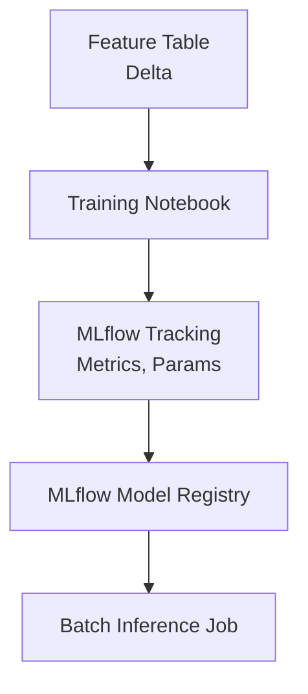

# MLflow Training & Inference Pipeline

## 📌 Project Overview
A Databricks-based ML pipeline demonstrating experiment tracking, model registry usage, and batch inference.

## 🏗️ Architecture Diagram




## 🛠️ Tech Stack
- MLflow
- Databricks
- Python
- Delta Lake

## ✨ Features
- Model training with MLflow tracking
- Model registry integration
- Batch inference pipeline
- Metrics and artifact logging

## 📂 Project Structure
- notebooks/train.py
- notebooks/batch_inference.py
- requirements.txt
- inference/ (generated output)


## 🚀 How to Run
1. Create and activate a virtual environment

```powershell
cd d:\repo\dexter-data-engineering-portfolio\mlflow-pipeline
py -3.11 -m venv .venv
.\.venv\Scripts\Activate.ps1
```

2. Install dependencies

```powershell
python -m pip install --upgrade pip
python -m pip install -r requirements.txt
```

3. Train and register the model

```powershell
python notebooks\train.py
```

4. Run batch inference

```powershell
python notebooks\batch_inference.py
```

5. Check outputs
- Local MLflow runs: `mlruns/`
- Local registry DB: `mlflow.db`
- Batch predictions: `inference/predictions.csv`

Optional: run MLflow UI locally

```powershell
python -m mlflow ui --backend-store-uri sqlite:///mlflow.db
```

### One-command pipeline run (Makefile-style)

If you have `make` available (for example in Git Bash), run:

```bash
make run
```

Available targets:
- `make install` (install dependencies)
- `make train` (train + register model)
- `make infer` (batch inference)
- `make run` (train then infer)

Windows fallback (no `make` required):

```powershell
.\run_pipeline.ps1
```

Command Prompt fallback:

```bat
run_pipeline.cmd
```

## 🧠 Design Decisions

### Why MLflow for Tracking

MLflow was chosen for experiment tracking because:

1. **Open-source & vendor-agnostic**: No lock-in to a specific cloud provider; works locally or in any cloud environment (AWS, Azure, GCP, Databricks).
2. **Lightweight and easy to use**: Minimal boilerplate code required to log parameters, metrics, and artifacts. Simple REST API and Python client make integration straightforward.
3. **Local-first**: Can run fully locally with SQLite backend (`mlflow.db`) for development, then scale to production registries.
4. **Reproducibility**: Automatically captures code versions (via git info), dependencies, and all hyperparameters, making experiments fully reproducible.
5. **Cross-framework support**: Works with scikit-learn, TensorFlow, PyTorch, XGBoost, and many others without custom wrappers.
6. **Model Registry**: Built-in model versioning and staging system simplifies model governance (dev → staging → production).
7. **Web UI**: Interactive dashboard for browsing runs, comparing metrics, and visualizing training progress without additional tools.

### Registry Versioning Strategy

Model versions are tracked as follows:

- **Version auto-incrementing**: Each training run that logs to `wine-quality-model` creates a new version (1, 2, 3, etc.).
- **Production promotion**: Use model stages (None → Staging → Production) to control which version is used for inference.
- **Fallback to latest**: The batch inference script resolves model versions by:
  1. Environment variable `MODEL_VERSION` if explicitly set.
  2. Environment variable `MODEL_STAGE` if set (e.g., "Production").
  3. Latest version by default if neither is specified.
- **Reproducibility**: Each registered model version preserves the exact training parameters, accuracy metric, and artifact path.  

## 🔮 Future Enhancements
- Add real-time inference  
- Add feature store integration  

## 📚 Key Learnings
(Add your reflections)
