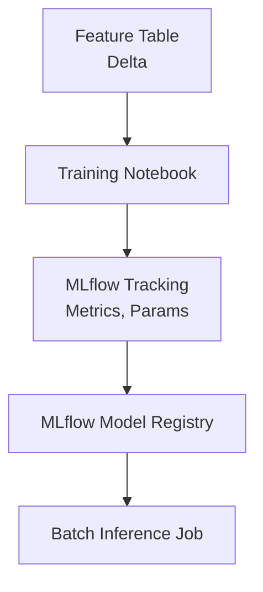

# MLflow Training & Inference Pipeline

## 📌 Project Overview
A Databricks-based ML pipeline demonstrating experiment tracking, model registry usage, and batch inference.

## 🏗️ Architecture Diagram




## 🛠️ Tech Stack
- MLflow
- Databricks
- Python
- Delta Lake

## ✨ Features
- Model training with MLflow tracking
- Model registry integration
- Batch inference pipeline
- Metrics and artifact logging

## 📂 Project Structure
- notebooks/train.py
- notebooks/batch_inference.py
- requirements.txt
- inference/ (generated output)


## 🚀 How to Run
1. Create and activate a virtual environment

```powershell
cd d:\repo\dexter-data-engineering-portfolio\mlflow-pipeline
py -3.11 -m venv .venv
.\.venv\Scripts\Activate.ps1
```

2. Install dependencies

```powershell
python -m pip install --upgrade pip
python -m pip install -r requirements.txt
```

3. Train and register the model

```powershell
python notebooks\train.py
```

4. Run batch inference

```powershell
python notebooks\batch_inference.py
```

5. Check outputs
- Local MLflow runs: `mlruns/`
- Local registry DB: `mlflow.db`
- Batch predictions: `inference/predictions.csv`

Optional: run MLflow UI locally

```powershell
python -m mlflow ui --backend-store-uri sqlite:///mlflow.db
```

### One-command pipeline run (Makefile-style)

If you have `make` available (for example in Git Bash), run:

```bash
make run
```

Available targets:
- `make install` (install dependencies)
- `make train` (train + register model)
- `make infer` (batch inference)
- `make run` (train then infer)

Windows fallback (no `make` required):

```powershell
.\run_pipeline.ps1
```

Command Prompt fallback:

```bat
run_pipeline.cmd
```

## 🧠 Design Decisions
- Why MLflow for tracking  
- Registry versioning strategy  

## 🔮 Future Enhancements
- Add real-time inference  
- Add feature store integration  

## 📚 Key Learnings
(Add your reflections)
