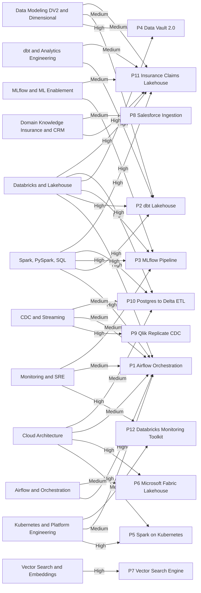

Legend:
- High = strong project coverage
- Medium = moderate project coverage

```mermaid
flowchart LR
    %% Projects
    P1[P1 Airflow Orchestration]
    P2[P2 dbt Lakehouse]
    P3[P3 MLflow Pipeline]
    P4[P4 Data Vault 2.0]
    P5[P5 Spark on Kubernetes]
    P6[P6 Microsoft Fabric Lakehouse]
    P7[P7 Vector Search Engine]
    P8[P8 Salesforce Ingestion]
    P9[P9 Qlik Replicate CDC]
    P10[P10 Postgres to Delta ETL]
    P11[P11 Insurance Claims Lakehouse]
    P12[P12 Databricks Monitoring Toolkit]

    %% Skills
    S1[Databricks and Lakehouse]
    S2[Airflow and Orchestration]
    S3[dbt and Analytics Engineering]
    S4[Data Modeling DV2 and Dimensional]
    S5[Spark, PySpark, SQL]
    S6[CDC and Streaming]
    S7[Cloud Architecture]
    S8[MLflow and ML Enablement]
    S9[Vector Search and Embeddings]
    S10[Kubernetes and Platform Engineering]
    S11[Monitoring and SRE]
    S12[Domain Knowledge Insurance and CRM]

    %% High proficiency links
    S1 -->|High| P1
    S1 -->|High| P2
    S1 -->|High| P3
    S1 -->|High| P4
    S1 -->|High| P10
    S1 -->|High| P11

    S2 -->|High| P1

    S3 -->|High| P2

    S4 -->|High| P4

    S5 -->|High| P1
    S5 -->|High| P2
    S5 -->|High| P3
    S5 -->|High| P10
    S5 -->|High| P11

    S6 -->|High| P9

    S7 -->|High| P5
    S7 -->|High| P6

    S8 -->|High| P3

    S9 -->|High| P7

    S10 -->|High| P5

    S11 -->|High| P12

    S12 -->|High| P11

    %% Medium proficiency links
    S2 -->|Medium| P6

    S3 -->|Medium| P11

    S4 -->|Medium| P2
    S4 -->|Medium| P11

    S6 -->|Medium| P1
    S6 -->|Medium| P10

    S7 -->|Medium| P1
    S7 -->|Medium| P10

    S8 -->|Medium| P11

    S10 -->|Medium| P1
    S10 -->|Medium| P12

    S11 -->|Medium| P1
    S11 -->|Medium| P3

    S12 -->|Medium| P8
```
